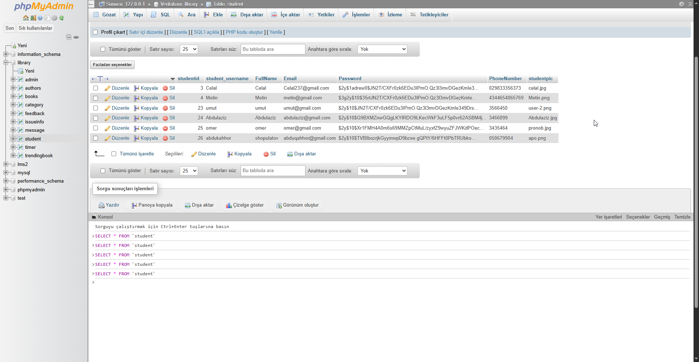

### Project Overview

This project is about Online Library Management System. 
There are two types of users: **Admin** and **Students**. 
#### Admin can see:

- students list who have registered.
- the books, add and update the information of books.
- books that students have requested.

#### Students can see:
 information of books
 request for a book after registration
 Students can message the admin
  

### Features:
- Beautiful User Interface
- SHA used for password protection
- Asynchronous search funtionality in books
- Search by name,category.
- Users can write feedback
- Messaging system between students and users. 
- Student can request a book.

Technologies used:
- `HTML`
- `CSS`
- `Javascript`
- `Php`
- `MySQL`
- `Ajax`

Folder structure:
- css: style.css
- images: user images
- js: for script files
- php: php files
- sql: sql script for database
*Preview:*

### Usage: 
Create MySQL database called library and then drag and drop library.sql file from sql folder.
click localhost Link: [library](http://localhost/library/php/index.php)